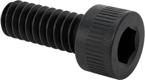
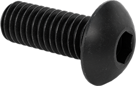
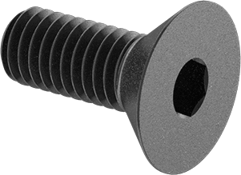
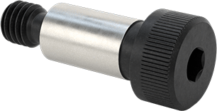

# Fastener Standards

A guide on fasteners and fastener standards common in FRC. They come in all sorts of shapes and sizes for various different applications and use cases. At there core, they are used to attach 2 or more parts together in order to contruct your robot. 

## Fasteners in CAD

### Why?

Putting all of your fasteners in your CAD is **very important** for a few reasons. Putting hardware in your CAD lets you check clearences between parts, have an accurate BOM so you know exactly what you need to order, and it makes it easy for your team to assemble the robot. 

### Best Practices

Before we get into the different types of fasteners, we must first talk about CAD best practices. Putting your fasteners into the document in the wrong way can and will lag your document. 

Standard Content - Onshape has a feature called "Standard Content" that has a wide variety of fasteners ready to import and be used in your assemblies. 

McMaster Carr - Sometimes, the Standard Content tab will not have the exact size or type of fastener that you need. This is where we go to the next best thing: McMasterCarr. McMaster has every single type of fastener you can think of. The best thing? Every single one has their own CAD file, free to download. So, when you have a time where the fastener you need isn't in Standard Content? Go to McMaster, download the file you need, and you will be back on track. 

Replicate Tool - You only need to import each unique size of fastener per assembly. After, use the extremely useful "Replicate" tool to copy that piece of hardware into every place you need it to be. This massively reduces load times and cleans up your assemblies significantly, making it easier for you and others to navigate your CAD.

## Bolts and Nuts

### Bolts
| Type of Bolt | Description | Image |
|:--------------:|:-------:|:-------:|
| Socket Head Cap Bolt (SHCS)| Standard bolt, hard to strip out due to the larger tool used with it | <> |
| Button Head Bolt | Has a wider, rounded head that is thinner than the socket head bolt |  |
| Flathead/Countersunk Bolt | Meant to be flush with the material, requires you to countersink the hole its going into |  |
| Shoulder Bolt | Bolt with a smooth portion mean to act as a small shaft for a bearing or bushing |  |

### Nuts
| Types of Nuts | Description | Image |
|:-------------:|:-------:|:---------:|
| Nylock Nuts | Standard nut; has nylon insert to prevent the nut from loosening |  |
| Low Profile Nylock Nuts | Thinner than a standard nylock nut, used when you need a thinner nut |  |
| Rivnuts | Installed with special tool, alternative to tapping, similar to a rivet but with threads |  |
| Heat Set Inserts | Used in 3D Printed parts to give the part a brass thread, installed with a soldering iron |  |
| Tee Nut | Nut pressed into wood, mainly used with bumpers |  |
| Wing Nut | Nut tightened by hand, useful for mounting bumpers |  |
| PEM Nuts | A nut pressed into material too thin to tap; See [Fabworks's Guide](https://www.fabworks.com/resources/guidelines/hardware) on how to use |  |

### Imperial Bolt Sizes
| Thread Size | Uses | SHCS/BHCS Tool Size |
|:-----------:|:---------:|:-------------------:|
| \#4-40 | Rio Mounting | 3/32 - 1/16 |
| \#6-32 |  | 7/64 - 5/64 |
| \#8-32 | VersaPlanetary | 9/64 - 3/32 |
| \#10-32 | Max Planetary; Neo, Vortex, Falcon, Kraken Mounting, Swerve Mounting; Tapped Rounded Hex | 5/32 - 1/8 |
| 1/4-20 | Used where you want more strength; tapped churro | 3/16 - 5/32 |

!!! Important
    Modern FRC generally uses two different types of imperial bolts, #10-32 and 1/4-20. FRC COTS components primarily utilize 10-32 fasteners, and with a bit of effort, we can make robots that use almost exclusively #10-32 hardware. In general:

    - \#10-32 is used for almost everything: retaining shafts, screwing into motors, superstructure, etc.
    - 1/4-20 is used for structural applications where more strength is required than #10 can provide. 

### Metric Bolt Sizes
While most of modern FRC is imperial, there are still a few components that use metric hardware to mount.

| Thread Size | Uses | SHCS Tool Size |
|:-----------:|:---------:|:-------------------:|
| M3 | Mounting Neo550 Motor, Ultraplanetary Gearboxes | M2.5 |
| M4 | Mounting 775pros, BAG motors | M3 |
| M5 | Mounting Snowblower Motors | M4 |
| M6 | PDP Battery Lug Mount | M5 |

When designing around hardware, it is best to use the **[hole tool](https://cad.onshape.com/help/Content/hole.htm)** or memorize the chart (Coming Soon)

- \#10-32 hardware uses a hole diameter of **0.196 inches** for a standard fit
- 1/4-20 hardware uses a hole diameter of **0.257 inches** for a standard fit

## Rivets

### Types of Rivets

### Rivet Sizes

## Tapped Components

**Coming Soon**

## Bolt Retention

Nylock Nuts

Loctite

## Welding

**Coming Soon**

## Sourcing Hardware

**Coming Soon**

<!-- Include different kinds of hardware and where to buy them? -->

 