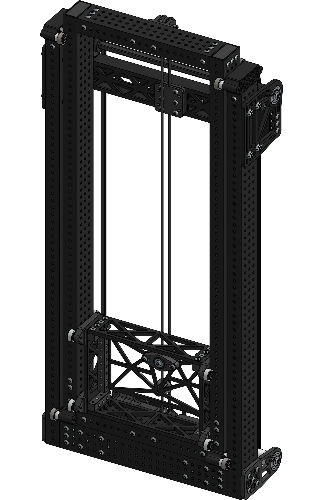

# Cascade Elevators
Cascade elevators help move other mechanisms vertically. The first stage is driven directly and the subsequent stages are linked with loops of line, causing all the stages to extend up an equal amount. This is the "cascading" motion. They are generally faster than continuous elevators but the typical design doesn't allow anything to pass through the stages.

-   
[{width=63%}](wcp_greyt_elevator.md)

    ---

    A very commonly used cascade elevator design using the WCP GreyT elevator kit. Driven by chain and string.
    
    [:octicons-arrow-right-24: WCP's GreyT Cascade Elevator](wcp_greyt_elevator.md)

-   
[{width=63%}](2_stage_elevator.md)

    ---

    Clean 2-stage cascade elevator with a plate carriage
    
    [:octicons-arrow-right-24: 2-Stage Cascade Elevator](2_stage_elevator.md)

-   
[{width=80%}](3_stage_elevator.md)

    ---

    Clean 3-stage cascade elevator with a plate carriage
    
    [:octicons-arrow-right-24: 3-Stage Cascade Elevator](3_stage_elevator.md)

 